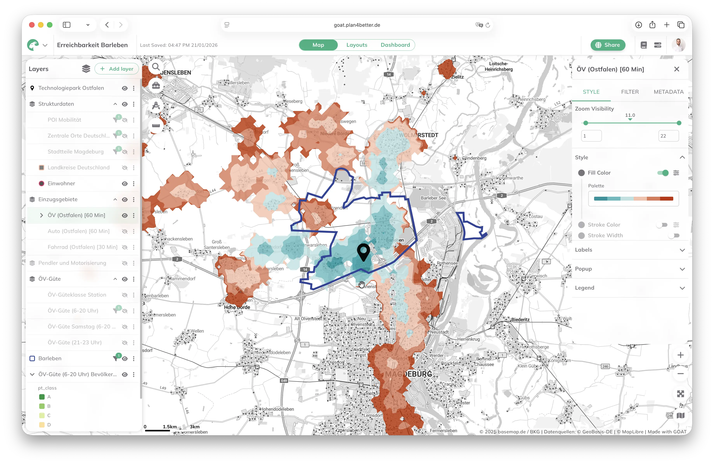

<div id="top"></div>

<p align="center">
<a href="https://plan4better.de/goat" target="_blank" rel="noopener noreferrer">

</a>

<h1 align="center">GOAT</h1>

<p align="center">
Intelligent software for modern web mapping and integrated planning
<br />
<a href="https://plan4better.de/goat" target="_blank" rel="noopener noreferrer">Website</a>
</p>
</p>

<p align="center">
   <a href="https://github.com/plan4better/goat/blob/main/LICENSE" target="_blank" rel="noopener noreferrer"></a>
   <a href="https://github.com/plan4better/goat/pulse" target="_blank" rel="noopener noreferrer"></a>
    <a href="https://github.com/plan4better/goat/issues?q=is:issue+is:open+label:%22%F0%9F%99%8B%F0%9F%8F%BB%E2%80%8D%E2%99%82%EF%B8%8Fhelp+wanted%22" target="_blank" rel="noopener noreferrer"></a>
</p>

<br/>

## ✨ About GOAT

<p align="center">
  <picture>
    <!-- Dark theme -->
    <source srcset=".github/assets/goat_screenshot_dark.webp" media="(prefers-color-scheme: dark)">
    <!-- Light theme -->
    <source srcset=".github/assets/goat_screenshot_light.webp" media="(prefers-color-scheme: light)">
    <!-- Fallback -->
    
  </picture>
</p>


<br/>

GOAT is a free and open source WebGIS platform. It is an all-in-one solution for integrated planning, with powerful GIS tools, integrated data, and comprehensive accessibility analyses for efficient planning and fact-based decision-making.

**Try it out in the cloud at <a href="https://goat.plan4better.de" target="_blank" rel="noopener noreferrer">goat.plan4better.de</a>**

For more information check out:

<a href="https://goat.plan4better.de/docs" target="_blank" rel="noopener noreferrer">GOAT Docs</a>

<a href="https://www.linkedin.com/company/plan4better" target="_blank" rel="noopener noreferrer">Follow GOAT on LinkedIn</a>

<a href="https://twitter.com/plan4better" target="_blank" rel="noopener noreferrer">Follow GOAT on Twitter</a>

<br/>

## Built on Open Source

GOAT is a **monorepo** project leveraging a modern, full-stack architecture.

### Frontend & Shared UI Components

- 💻 <a href="https://www.typescriptlang.org/" target="_blank" rel="noopener noreferrer">Typescript</a>

- 🚀 <a href="https://nextjs.org/" target="_blank" rel="noopener noreferrer">Next.js</a>

- ⚛️ <a href="https://reactjs.org/" target="_blank" rel="noopener noreferrer">React</a>

- 🗺️ <a href="https://maplibre.org/" target="_blank" rel="noopener noreferrer">Maplibre GL JS</a>

- 🎨 <a href="https://mui.com/" target="_blank" rel="noopener noreferrer">MUI</a>

- 🔀 <a href="https://reactflow.dev/" target="_blank" rel="noopener noreferrer">React Flow</a>

- 🔒 <a href="https://authjs.dev/" target="_blank" rel="noopener noreferrer">Auth.js</a>

- 🧘‍♂️ <a href="https://zod.dev/" target="_blank" rel="noopener noreferrer">Zod</a>

### Backend & API Services

- 🐍 <a href="https://www.python.org/" target="_blank" rel="noopener noreferrer">Python</a>

- ⚡️ <a href="https://fastapi.tiangolo.com/" target="_blank" rel="noopener noreferrer">FastAPI</a>

- 📦 <a href="https://pydantic.dev/" target="_blank" rel="noopener noreferrer">Pydantic</a>

- 🗄️ <a href="https://www.sqlalchemy.org/" target="_blank" rel="noopener noreferrer">SQLAlchemy</a>

- 🐘 <a href="https://www.postgresql.org/" target="_blank" rel="noopener noreferrer">PostgreSQL</a>

- 🔐 <a href="https://www.keycloak.org/" target="_blank" rel="noopener noreferrer">Keycloak</a>

### Geospatial & Analytics

- 🦆 <a href="https://duckdb.org/" target="_blank" rel="noopener noreferrer">DuckDB</a>

- 🛶 <a href="https://ducklake.select/" target="_blank" rel="noopener noreferrer">DuckLake</a>

- ⚙️ <a href="https://www.windmill.dev/" target="_blank" rel="noopener noreferrer">Windmill</a>

- 🌍 <a href="https://gdal.org/" target="_blank" rel="noopener noreferrer">GDAL</a>

- 🗃️ <a href="https://docs.protomaps.com/pmtiles/" target="_blank" rel="noopener noreferrer">PMTiles</a>

- 🛰️ <a href="https://stacspec.org/" target="_blank" rel="noopener noreferrer">STAC</a>

<br/>


## 🚀 Getting started

### ☁️ Cloud Version
GOAT is also available as a fully hosted cloud service.  If you prefer not to manage your own infrastructure, you can get started instantly with our trial version and choose from one of our available subscription tiers. Get started at <a href="https://goat.plan4better.de" target="_blank" rel="noopener noreferrer">goat.plan4better.de</a>.

### 🐳 Self-hosting (Docker)

GOAT runs on a single Linux server with Docker Compose: web app and APIs, login
(Keycloak), object storage (Garage), PostgreSQL/PostGIS, the Windmill job engine
and a Caddy proxy that takes care of HTTPS (Let's Encrypt, your own certificate,
or plain HTTP behind your own load balancer).

**Important:** self-hosted deployments are community-supported. We do not offer
official support for managing your infrastructure.

Each GOAT release ships the deployment bundle as `goat-compose-<version>.tar.gz`
on its [GitHub release page](https://github.com/plan4better/goat/releases); the
same files live in [`deploy/compose/`](deploy/compose/).

```bash
tar xzf goat-compose-<version>.tar.gz && cd goat-compose
./setup.sh             # public URL, TLS mode, admin email -> .env with random secrets
docker compose up -d
./smoke.sh             # verifies the installation end to end
```

Docker Engine 24+ and Docker Compose 2.23+ must be installed; the bundle checks
them but does not install them. The self-hosting guide covers the rest:

- [Overview](https://goat.plan4better.de/docs/self_hosting/overview): Docker Compose or Kubernetes, what each includes
- [Installation](https://goat.plan4better.de/docs/self_hosting/docker_compose/installation): requirements, setup, first login
- [HTTPS and addresses](https://goat.plan4better.de/docs/self_hosting/docker_compose/https): TLS modes, load balancer, company CA
- [External services](https://goat.plan4better.de/docs/self_hosting/docker_compose/external_services): your own S3, Keycloak, email
- [Operations](https://goat.plan4better.de/docs/self_hosting/docker_compose/operations): users, base data, backups, upgrades, troubleshooting
- [Configuration reference](https://goat.plan4better.de/docs/self_hosting/docker_compose/configuration): every setting in `.env`
- [Kubernetes](https://goat.plan4better.de/docs/self_hosting/kubernetes): the Helm chart, whose source lives in [`deploy/helm/goat/`](deploy/helm/goat/)

A short version for the server lives next to the files in
[`deploy/compose/README.md`](deploy/compose/README.md).

The `compose.yaml` in the repository root is for local development only
(infrastructure services, plus the `dev` profile with a devcontainer).


## 👩‍⚖️ License

GOAT is a commercial open‑source project. The core platform is licensed under the
<a href="https://www.gnu.org/licenses/gpl-3.0.en.html" target="_blank" rel="noopener noreferrer">GNU General Public License v3.0 (GPLv3)</a>,
which allows anyone to use, modify, and distribute the software under the terms of the GPL.

The full platform — including user management, teams, and organizations — is part
of the open-source core. Optional commercial services (hosting, support, and
enterprise capabilities) are available for organizations that need them.


## ✍️ Contributing
We welcome contributions of all kinds, bug reports, documentation improvements, new features, and feedback that helps strengthen the platform. Please see our [contributing guide](/CONTRIBUTING.md).
